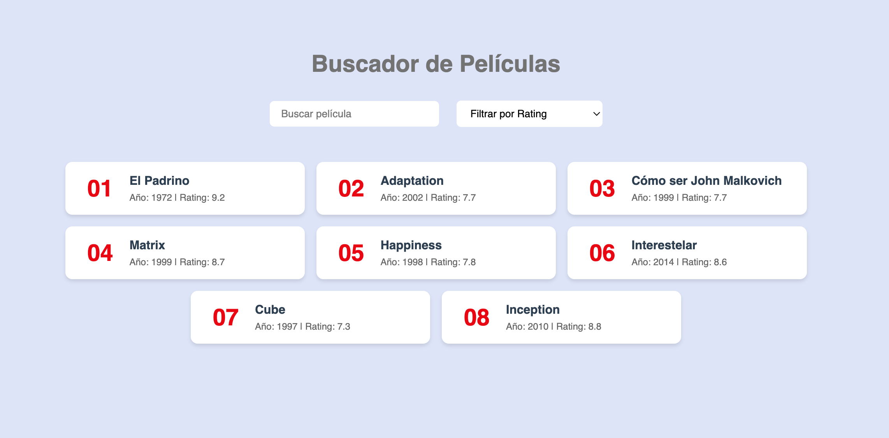

# Mi Proyecto de Búsqueda y Filtrado en React

Este proyecto te servirá para practicar y entender cómo implementar funcionalidades de búsqueda y filtrado en React. Comprender el uso del estado (useState) y métodos de array como filter() en un caso práctico.

## 🎯  Objetivo de Aprendizaje

Esta aplicación te servirá para:
- Practicar el uso de useState en React
- Implementar búsquedas en tiempo real
- Entender cómo filtrar arrays de objetos
- Trabajar con múltiples estados simultáneamente

## 💡 Lo Que Aprenderás

- Manejar el estado en React usando useState
- Implementar búsquedas case-insensitive
- Filtrar datos basados en diferentes criterios
- Actualizar la interfaz en tiempo real según las interacciones del usuario

## 🚀 Características

- Búsqueda de películas por nombre en tiempo real
- Filtrado por rating (mayor que 8.0, 8.5, 8.8, 9.0)
- Visualización de películas en tarjetas con información detallada
- Interfaz responsive y amigable

## 🛠️ Tecnologías Utilizadas

- React.js
- CSS para estilos
- JavaScript ES6+

